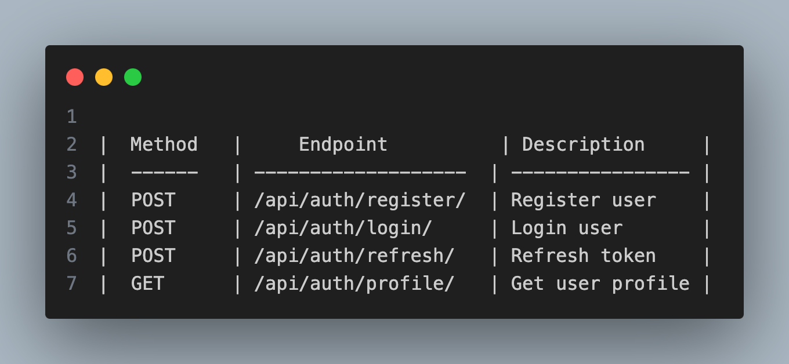
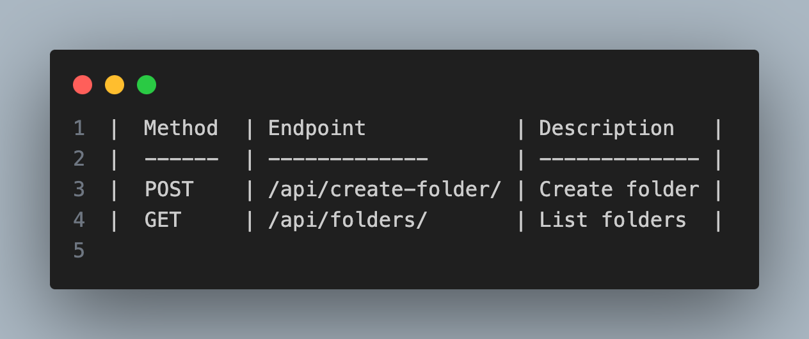
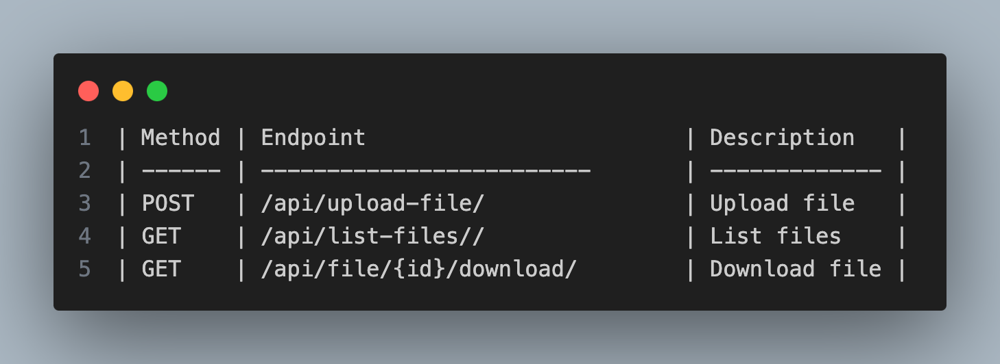
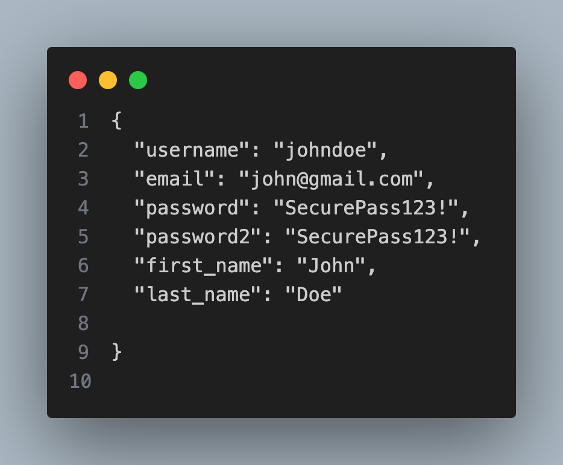
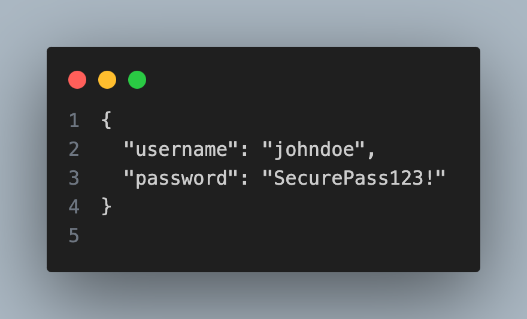
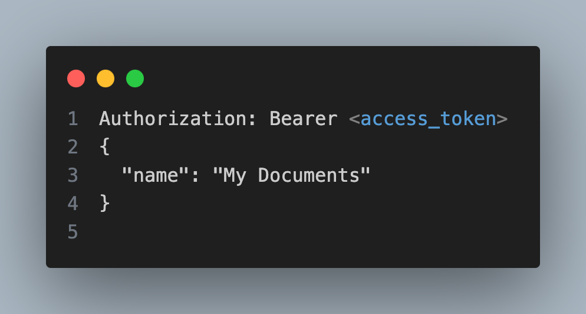
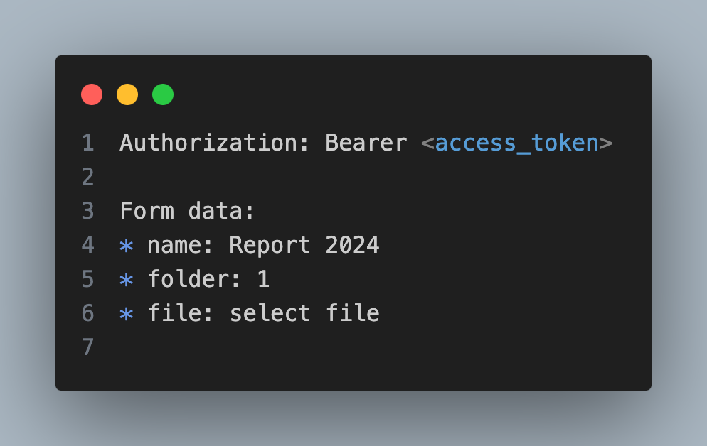
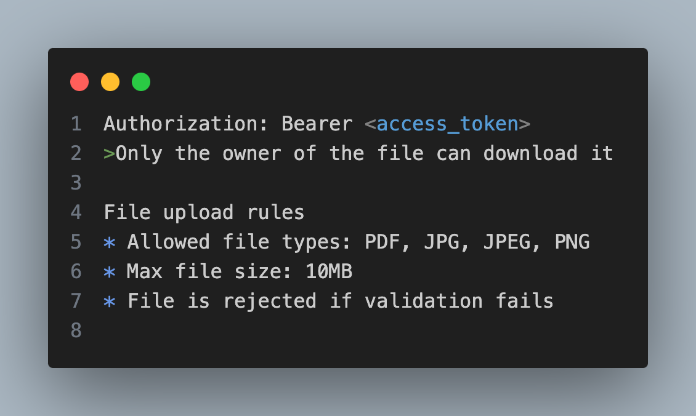
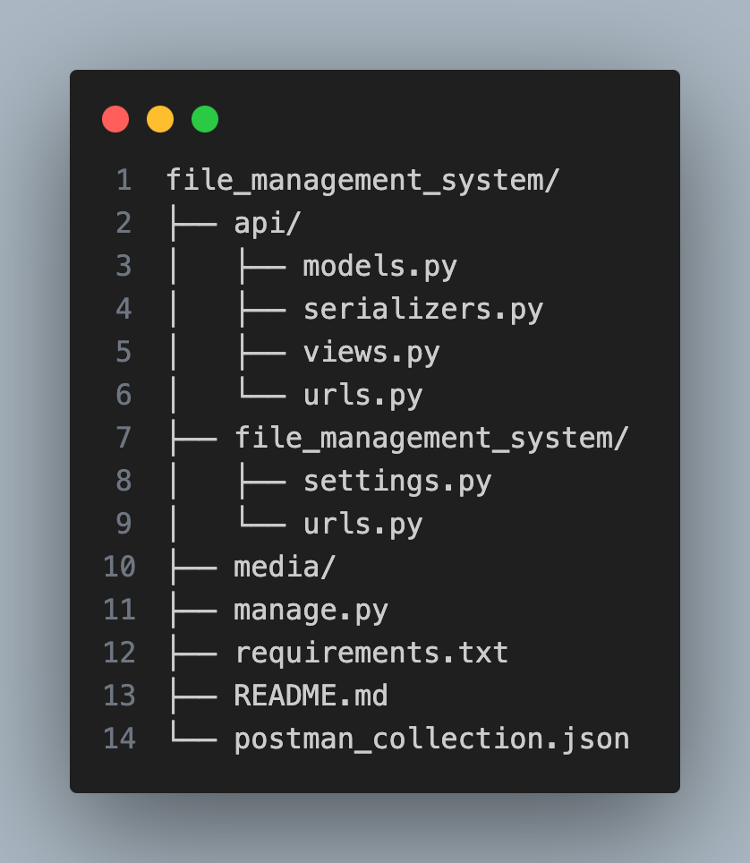

# File Management System API

This project is a simple and secure file management backend built using Django and Django REST Framework.The main idea behind this project is to allow users to create folders, upload files and download them securely using authentication.
This was built mainly for learning purpose, but the structure is close to real world backend systems.

**What this project does**

* User registration and login using JWT authentication
* Each user can create their own folders
* Files can be uploaded only inside user folders
* Only allowed file types can be uploaded
* Users can download only their own files
* No user can access another user data

**Tech used**

* Django 4.2.7
* Django REST Framework
* Simple JWT for authentication
* SQLite database (for development)

**Setup and Installation**

Requirements
* Python 3.8 or above
* pip
* virtualenv (optional but recommanded)

### Installation steps

**clone the Repo**
  - git clone <your-repo-url>
  - cd file_management_system

**Create virtual environment**

  - python -m venv venv
  - source venv/bin/activate #for mac
  - venv\Scripts\activate #for windows

**Install dependencies**

  - uv pip install -r requirements.txt   # i am using uv so started with uv 

**Run migrations**
  - python manage.py makemigrations
  - python manage.py migrate

**Create superuser (optional)**
  - python manage.py createsuperuser

**Start the server**

  - python manage.py runserver

# API Endpoints

**Authentication APIs**

 

**Folder APIs**

**File APIs**

# How to use the API

**Register user**

>POST /api/auth/register/

**Login**

>POST /api/auth/login/

**Create folder**

>POST /api/create-folder/

**Upload file**

  - This uses multipart form data

>POST /api/upload-file/

**Download file**

>GET /api/file/1/download/

**Security details**
  - JWT authentication is used for all protected APIs
  - Users can access only their own folders and files
  - Folder names are unique per user
  -File download is blocked if user is not owner

# Project structure

# Admin panel
Admin panel is available at:

  - http://127.0.0.1:8000/admin/

# Postman Collection

This project includes a Postman collection for testing all APIs

 - [https://documenter.getpostman.com/view/50032790/2sBXVbJEW6]

